<h1>Compte rendu de Front End  de Ebanking</h1>
<h3>Introduction :</h3>

Dans ce projet, nous avons simulé un système de banque en ligne, permettant de consulter les clients, de visualiser les opérations de chaque client, et d'effectuer des transactions comme le débit, le crédit et les transferts. Nous avons utilisé Angular pour le frontend et Java JEE pour le backend.

<h3>Liste des Clients  </h3>

<h3>Fonctionnalite Search </h3>

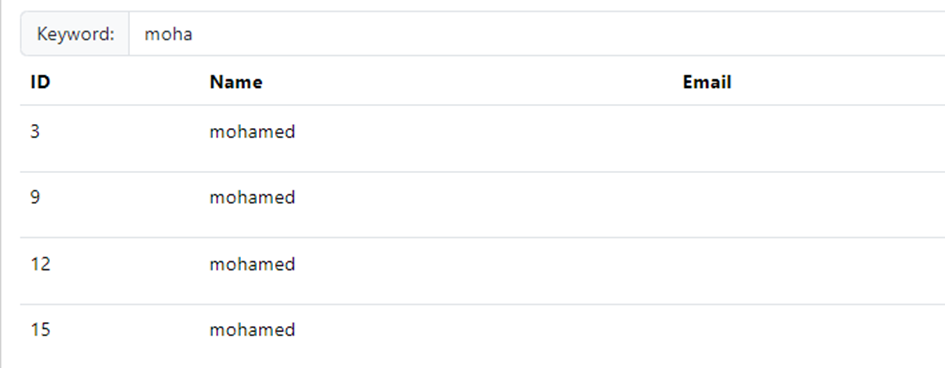

<h3>Creation d'un client</h3>
<h4>Get customers </h4>
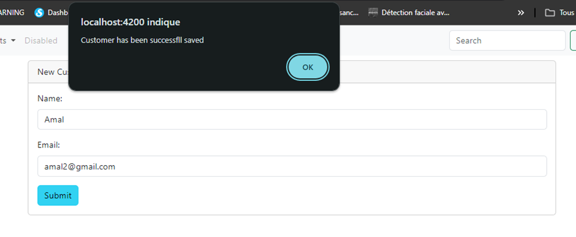

<h4>Test de Creation du client</h4>
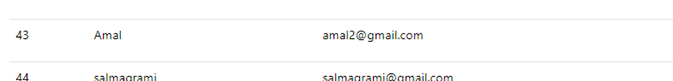

<h4>les Validations  </h4>
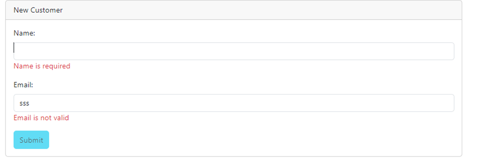

<h4>Supprimer un client  </h4>
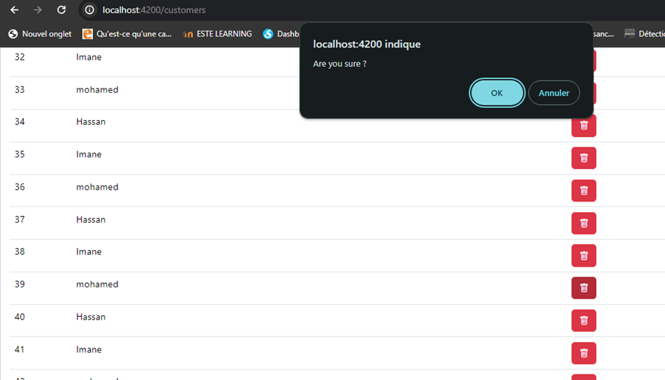

<h4>Consulter les operations d'un client  </h4>
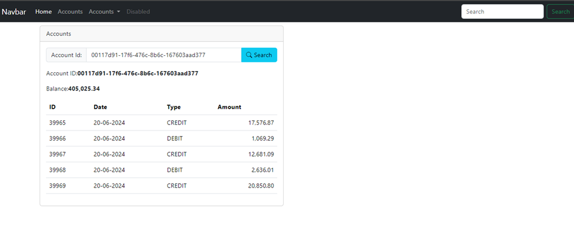

<h4>Effectuer une operation de debit </h4>

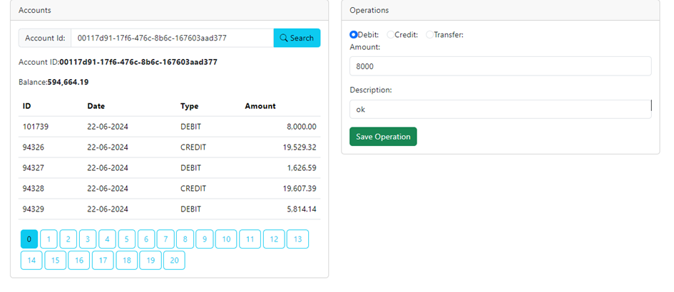
<h4>Order By Date du plus recent vers le plus ancien </h4>

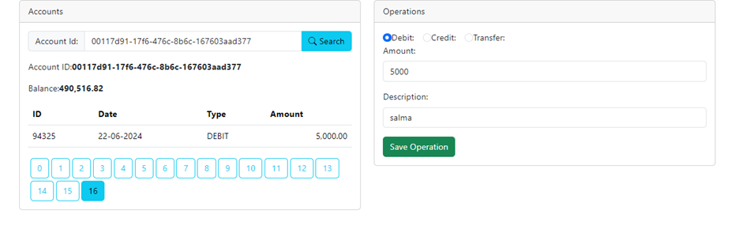
<h4>Effectuer une operation de credit </h4>

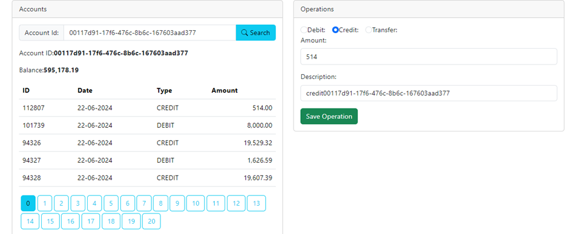
<h4>Effectuer une operation de transfert entre deux comptes</h4>

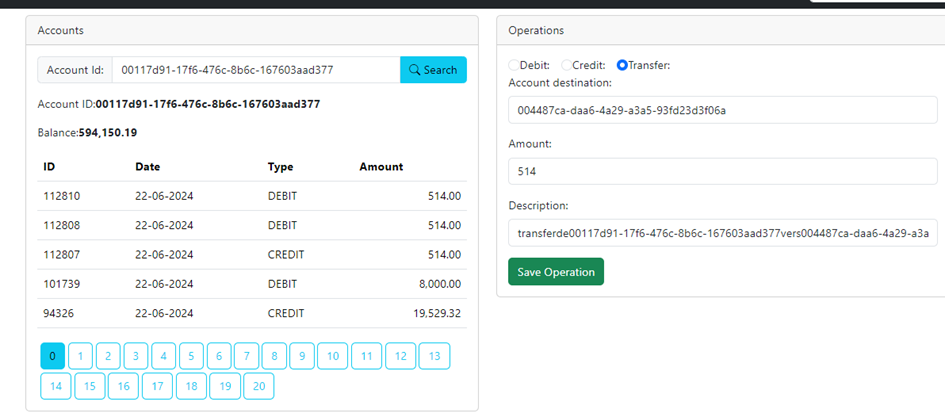
<h4>Ajout de boutton Account </h4>

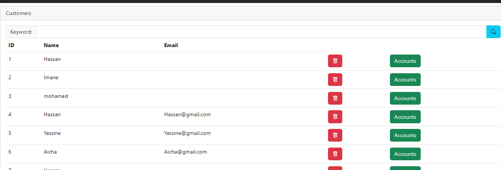
<h4>Un client specifique </h4>

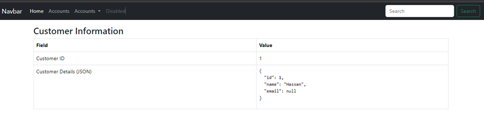

<h4>Conclusion</h4>

Ce projet a démontré notre capacité à intégrer Angular pour une interface utilisateur dynamique et Java JEE pour une logique backend robuste. La prochaine étape est d'ajouter Spring Security pour renforcer la sécurité de l'application, garantissant ainsi la protection des données des utilisateurs et des transactions.

