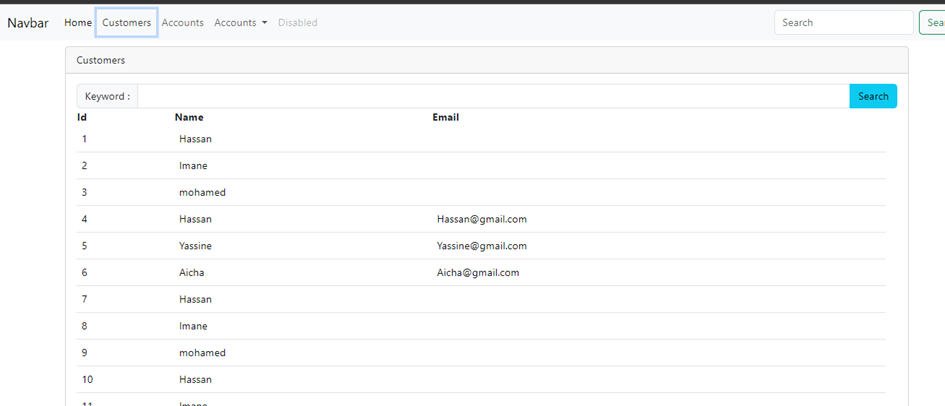

<h1>Compte rendu de Front End  de Ebanking</h1>
<h3>Introduction :</h3>

Dans ce projet, nous avons simulé un système de banque en ligne, permettant de consulter les clients, de visualiser les opérations de chaque client, et d'effectuer des transactions comme le débit, le crédit et les transferts. Nous avons utilisé Angular pour le frontend et Java JEE pour le backend.

<h3>Liste des Clients  </h3>

<h3>Fonctionnalite Search </h3>

<h3>Creation d'un client</h3>
<h4>Get customers </h4>

<h4>Test de Creation du client</h4>

<h4>les Validations  </h4>

<h4>Supprimer un client  </h4>

<h4>Consulter les operations d'un client  </h4>

<h4>Effectuer une operation de debit </h4>

<h4>Order By Date du plus recent vers le plus ancien </h4>

<h4>Effectuer une operation de credit </h4>

<h4>Effectuer une operation de transfert entre deux comptes</h4>

<h4>Ajout de boutton Account </h4>

<h4>Un client specifique </h4>

<h4>Prtie Security </h4>h4>

Pour sécuriser l'application backend de e-banking, j'ai configuré Spring Security pour utiliser les JSON Web Tokens (JWT) pour l'authentification et l'autorisation des utilisateurs. Voici les points clés de cette configuration :

### Annotations de Classe Principales
- `@Configuration` : Déclare la classe comme source de configuration.
- `@EnableWebSecurity` : Active la sécurité web de Spring Security.
- `@EnableMethodSecurity(prePostEnabled = true)` : Permet l'utilisation des annotations de sécurité au niveau des méthodes.

### Gestion des Utilisateurs
- Utilisation d'un **InMemoryUserDetailsManager** pour stocker les utilisateurs en mémoire avec des mots de passe cryptés à l'aide de BCrypt.
- Deux utilisateurs sont définis : `user1` avec le rôle `USER` et `admin` avec les rôles `USER` et `ADMIN`.

### Chaîne de Filtrage de Sécurité
- Configuration de la session en mode sans état (stateless).
- Désactivation de la protection CSRF.
- Autorisation des requêtes vers `/auth/login/**` et authentification requise pour toutes les autres requêtes.
- Configuration du serveur de ressources OAuth2 pour utiliser JWT.

### JWT (JSON Web Tokens)
- **Encodeur JWT** : Utilisé pour créer des JWT en utilisant une clé secrète.
- **Décodeur JWT** : Utilisé pour valider les JWT avec l'algorithme HS512.

### CORS (Cross-Origin Resource Sharing)
- Configuration pour permettre toutes les origines, méthodes et en-têtes, afin de faciliter la communication entre le frontend et le backend.

### Points de Terminaison dans `SecurityController`
- `@GetMapping("/profile")` : Retourne les détails de l'utilisateur authentifié actuel.
- `@PostMapping("/login")` : Authentifie l'utilisateur et génère un JWT qui est retourné comme jeton d'accès.

Cette configuration garantit une sécurité robuste pour l'application backend, en utilisant JWT pour l'authentification et l'autorisation, tout en permettant une flexibilité avec la configuration CORS.

<h4>Conclusion</h4>

Ce projet a démontré notre capacité à intégrer Angular pour une interface utilisateur dynamique et Java JEE pour une logique backend robuste. La derniere étape etait d'ajouter Spring Security pour renforcer la sécurité de l'application, garantissant ainsi la protection des données des utilisateurs et des transactions.

